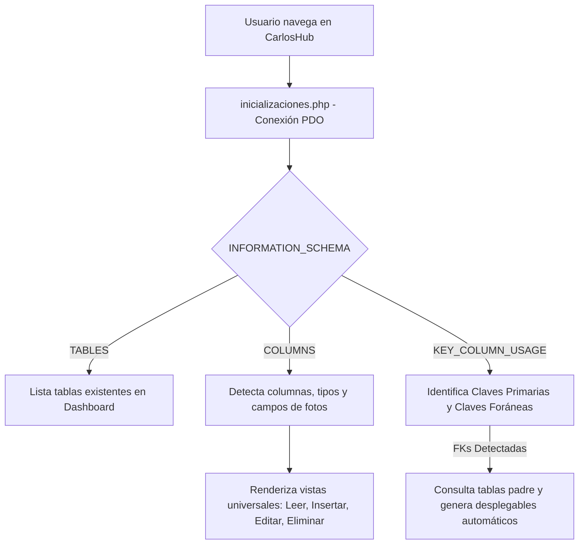

# CarlosHub - Gestor Dinámico de Bases de Datos MySQL

**CarlosHub** es una aplicación web en PHP diseñada para administrar, explorar y realizar operaciones CRUD (Crear, Leer, Actualizar y Eliminar) sobre cualquier base de datos **MySQL / MariaDB** de forma completamente dinámica y sin necesidad de declarar modelos o esquemas previos.

---

## 🚀 ¿Cómo Funciona la Arquitectura? El poder de `INFORMATION_SCHEMA`

En lugar de requerir que el desarrollador programe archivos o modelos para cada tabla, **CarlosHub inspecciona en tiempo real el diccionario de metadatos interno de MySQL (`INFORMATION_SCHEMA`)**:



### 1. Detección de Tablas (`INFORMATION_SCHEMA.TABLES`)
Permite listar dinámicamente únicamente las tablas base creadas por el usuario dentro de la base de datos activa:
```sql
SELECT TABLE_NAME 
FROM INFORMATION_SCHEMA.TABLES 
WHERE TABLE_SCHEMA = DATABASE() 
  AND TABLE_TYPE = 'BASE TABLE'
ORDER BY TABLE_NAME ASC;
```

### 2. Inspección de Columnas y Tipos (`INFORMATION_SCHEMA.COLUMNS`)
Obtiene la lista de campos de cualquier tabla, su orden posicional y si admiten valores nulos (`IS_NULLABLE`):
```sql
SELECT COLUMN_NAME, DATA_TYPE, COLUMN_KEY, IS_NULLABLE, COLUMN_COMMENT 
FROM INFORMATION_SCHEMA.COLUMNS 
WHERE TABLE_SCHEMA = DATABASE() 
  AND TABLE_NAME = :tabla
ORDER BY ORDINAL_POSITION ASC;
```

### 3. Detección de Claves Primarias (PK)
Identifica automáticamente la clave primaria de cualquier tabla para permitir editar o borrar filas con precisión:
```sql
SELECT COLUMN_NAME 
FROM INFORMATION_SCHEMA.KEY_COLUMN_USAGE 
WHERE TABLE_SCHEMA = DATABASE() 
  AND TABLE_NAME = :tabla 
  AND CONSTRAINT_NAME = 'PRIMARY';
```

### 4. Detección de Claves Foráneas (FK) y Relaciones
Localiza las columnas que tienen restricciones de clave foránea y qué tabla y columna referencian:
```sql
SELECT COLUMN_NAME, REFERENCED_TABLE_NAME, REFERENCED_COLUMN_NAME
FROM INFORMATION_SCHEMA.KEY_COLUMN_USAGE
WHERE TABLE_SCHEMA = DATABASE()
  AND TABLE_NAME = :tabla
  AND REFERENCED_TABLE_NAME IS NOT NULL;
```
Con esta información, los formularios de inserción y edición consultan la tabla padre y generan automáticamente un menú desplegable (`<select>`) con las opciones válidas.

---

## 🛡️ Seguridad y Sanitización Implementada

El proyecto cuenta con múltiples capas de seguridad activas:

1. **Sanitización de Inputs:**
   - Todas las entradas procedentes de `$_GET`, `$_POST` y `$_FILES` son procesadas mediante la función `sanitize_input()` para eliminar espacios sobrantes y caracteres de control.
   - Se valida el formato de identificadores con expresiones regulares (`^[a-zA-Z0-9_]+$`) mediante `is_valid_identifier()`.

2. **Inmunidad contra Inyección SQL:**
   - Los nombres de tablas y columnas se validan contra una **lista blanca estricta** obtenida desde `INFORMATION_SCHEMA`.
   - Todos los valores ingresados por el usuario se ejecutan mediante **sentencias preparadas con PDO (`prepare` y `execute`)**, utilizando parámetros nombrados o marcadores de posición (`?`).
   - Se utiliza comillado inverso seguro (`` `columna` ``) para identificadores de MySQL.

3. **Prevención de Cross-Site Scripting (XSS):**
   - Todas las cadenas impresas en el navegador pasan por la función de escape `e()` que utiliza `htmlspecialchars(..., ENT_QUOTES, 'UTF-8')`.

4. **Carga Segura de Archivos e Imágenes:**
   - Las imágenes subidas a la carpeta `Foto/` se verifican contra una lista blanca de extensiones permitidas (`jpg`, `jpeg`, `png`, `gif`, `webp`).
   - Se comprueba la firma binaria real con `getimagesize()` para asegurar que son imágenes legítimas.
   - Los nombres de archivo se renombran con hashes criptográficos aleatorios (`bin2hex(random_bytes(3))`) para prevenir sobreescrituras y vulnerabilidades de *Path Traversal*.
   - El directorio `Foto/` cuenta con un archivo `.htaccess` que desactiva la ejecución de scripts PHP.

---

## 📁 Estructura del Código

```text
CarlosHub/
├── db_Slect.php               # Selector visual de bases de datos MySQL
├── inicializaciones.php        # Conexión PDO, constantes BASE_URL y funciones de seguridad
├── style.css                  # Estilos del selector y bienvenida
├── Dashboard/
│   ├── dashboard.php          # Panel principal con listado de tablas (INFORMATION_SCHEMA.TABLES)
│   └── style.css              # Estilos del dashboard
├── Read/
│   ├── TablaUniversal.php     # Visualización dinámica, búsqueda universal y paginación
│   └── style.css              # Estilos de la tabla y menú lateral
├── Insert/
│   ├── InsertUniversal.php    # Formulario dinámico con cálculo predictivo de ID y FKs
│   ├── InsertUniversal2.php   # Procesamiento seguro de inserciones en BD
│   └── style.css              # Estilos de formularios de inserción
├── Edit/
│   ├── EditarUniversal.php    # Formulario dinámico con previsualización de fotos y FKs
│   ├── UpdateUniversal.php    # Procesamiento parametrizado de actualizaciones
│   └── style.css              # Estilos de formularios de edición
├── Delete/
│   └── DeleteUniversal.php    # Eliminación validada con listas blancas
└── Foto/
    ├── .htaccess              # Protección contra ejecución de scripts
    └── (imágenes subidas)     # Almacén de archivos multimedia
```

---

## ⚙️ Requisitos y Puesta en Marcha (XAMPP)

1. **Requisitos:**
   - PHP 7.4 o superior (PHP 8.0, 8.1, 8.2 compatible).
   - MySQL 5.7+ o MariaDB 10.3+.
   - Servidor web Apache (incluido en XAMPP).

2. **Instalación local:**
   - Clona este repositorio o copia la carpeta en `C:\xampp\htdocs\CarlosHub`.
   - Abre el **Panel de Control de XAMPP** e inicia los módulos **Apache** y **MySQL**.
   - Accede desde tu navegador web a:
     ```
     http://localhost/CarlosHub/db_Slect.php
     ```
   - Selecciona cualquier base de datos existente para empezar a gestionarla de inmediato.
